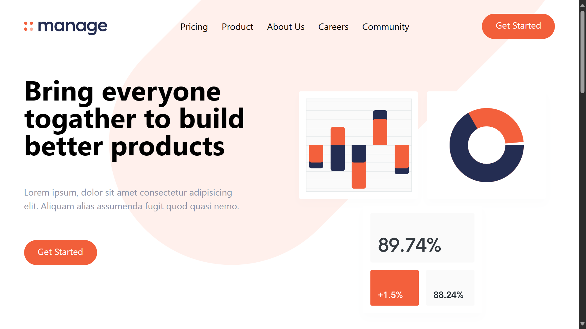
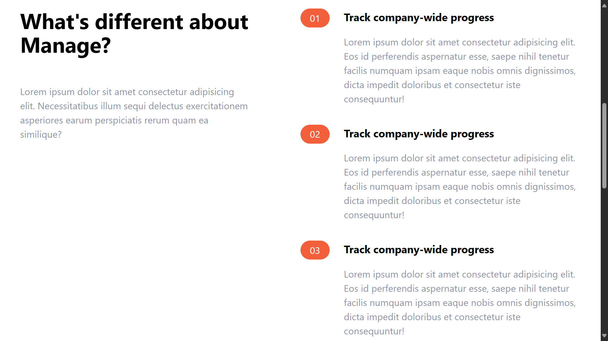
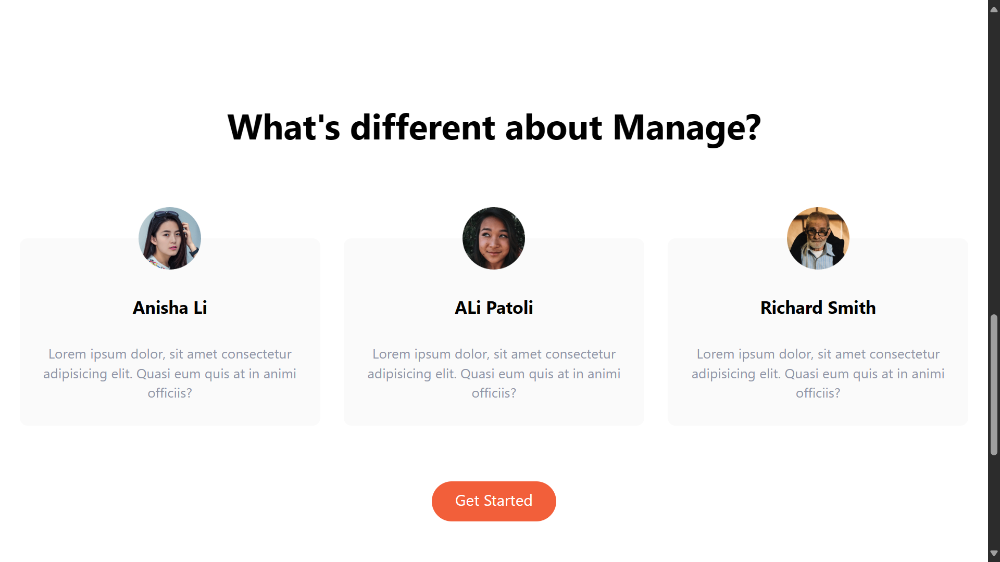
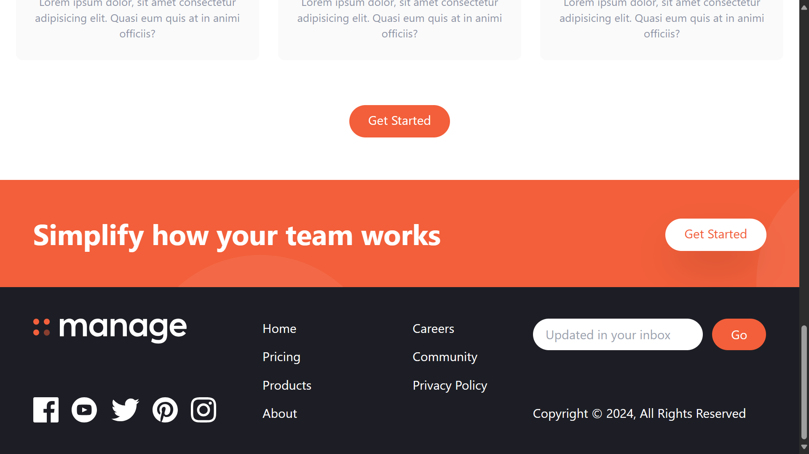

# Manage Landing Page

Welcome to the "Manage" landing page project! This project is designed to bring people together to build better products.

## Project Overview

The "Manage" landing page provides a clean, responsive design, allowing users to easily understand the key features and benefits of your product or service. The design is user-friendly, making it easy to navigate and visually appealing.

## Visit Project

Check out the live demo of the project [here](https://manage-a-landing-page.netlify.app/).

## Screenshots

Below are some screenshots showcasing the project:

## Technologies Used

- **HTML**: The foundational language for building the structure of the page.
- **Tailwind CSS**: A utility-first CSS framework that provides rapid styling.

## Getting Started

To run this project locally, follow these steps:

1. Clone the repository: git clone https://github.com/Bilal00404/Red-Store.git
2. Navigate to the project directory: cd Red-Store
3. Open the HTML file in your preferred browser.

## Contact
If you have any questions or suggestions, feel free to contact me at bilalchanna67@gmail.com.
